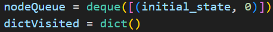
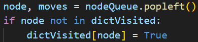
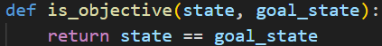
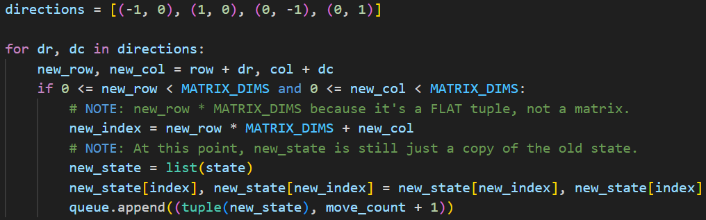

# Problem Formulation

## Used Thecnique
### Breadth First Search (BFS) with pruning of already evaluated states.

<br>
**...**
<br>


## Initial States
```python
# Unsolvable
[
    [4, 6, 2],
    [8, 1, 3],
    [7, 5, 0]
] 
# Solvable
[
    [6, 4, 2],
    [8, 1, 3],
    [7, 5, 0]
]
# Solvable
[
    [1, 2  3],
    [4, 5, 6],
    [7, 8, 0]
]
# Solvable
[
    [7, 5, 4],
    [1, 0, 3],
    [2, 6, 8]
]
```

## Objective State
```python
[
    [0, 1  2],
    [3, 4, 5],
    [8, 7, 8]
]
```

## Objective Test


## Set of Operations
- Move the empty tile (0) in one of four possible directions:
  - When the empty tile is at the center, it will have 4 children (nodes).
  - When it's a the center borders, it will have 3 children.
  - When it's at the corners, it will have 2 children.
- Generate new board states by swapping the empty tile with the adjacent tile in the chosen direction

## Successor Function
### Matrix used to generate children
```python
[(-1, 0), (1, 0), (0, -1), (0, 1)]
```
- (-1, 0) -> Retornar uma linha
- (+1, 0) -> Avançar uma linha
- (0, -1) -> Retornar uma coluna
- (0, +1) -> Avançar uma coluna

### Generating Children


## Results


