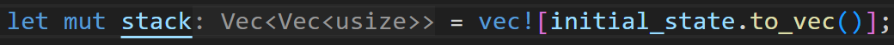
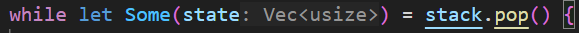
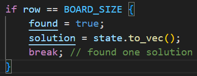
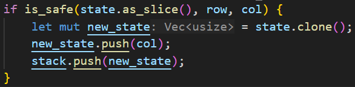
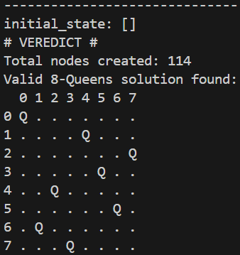
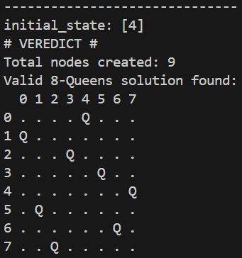
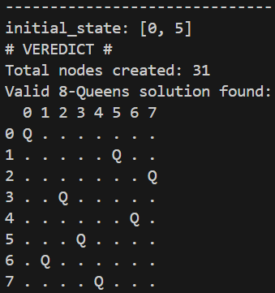
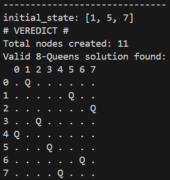

# Problem Formulation
- Place 8 queens on an 8x8 board such that no two queens threaten each other.
- No two queens can be in the same row, column, or diagonal.

## Used Thecnique
### Depth First Search (DFS)

<br>
...
<br>


## Initial States
```rust
# no queens
[]
# one queen (0x4)
[4]
# two queens (0x0, 1x5)
[0, 5]
# three queens (0x1, 1x5, 2x7)
[1, 5, 7]
```

## Objective State
- Any configuration of the 8x8 board which leads to no queens attacking each other.

## Objective Test


## Set of Operations
- Validate each new tile (queen placement) with is_safe.
- Push a new state into the stack when a safe one is found.
- Pop a state to continue DFS.

## Successor Function
- For a given row, try placing a queen in each column (0–7), in reverse order for left-to-right.

### Generating Children
Only states that pass the is_safe check are pushed to the stack.


## Results



