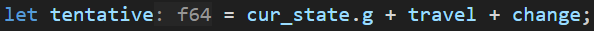
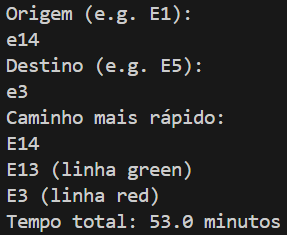
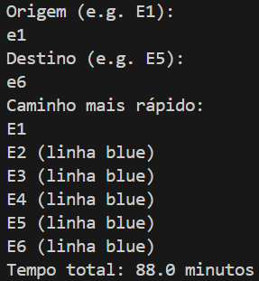
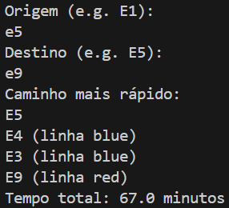

# Problem Formulation

- Get the shortest path in minutes between two stations (e.g. E1 to E14) including change of lines.

## Used Thecnique
### A*

## Initial States
- Any of the stations from E1 to E14.

## Objective State
- The destination station (e.g., E14) someone tends to arrive.

## Objective Test
- Check if the current station matches the destination station.
  

## Set of Operations
- Move to a directly connected station.
- Change lines if necessary at interchange stations (+5 minutes of walk).

## Successor Function
- For a given station, return all directly connected stations with their respective travel times and the line used.

### Generating Children
- Each child represents a neighboring station reachable from the current station.
- For each child, the algorithm calculates:
  - The cumulative travel time (cost so far).
  - The estimated remaining time using the heuristic.
  

## Results

